# Telehealth System - Architecture & UML Diagrams

## 1. System Architecture Overview

The telehealth system is built using a **microservices architecture** with the following key components:

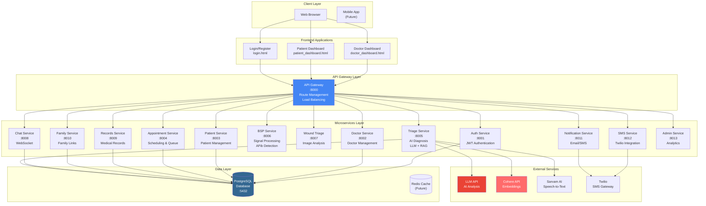

---

## 2. User Flow Diagrams

### 2.1 Patient Journey - Booking Appointment

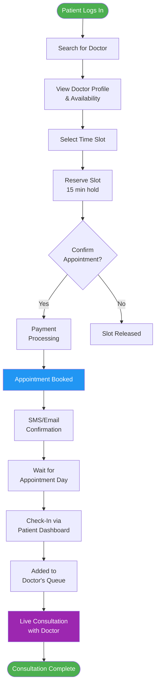

### 2.2 Doctor Journey - Daily Workflow

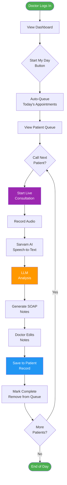

### 2.3 AI Triage Flow with Feedback Learning

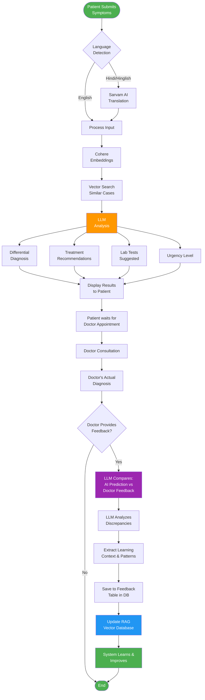

**Feedback Learning Process:**
1. **Initial AI Diagnosis**: LLM analyzes symptoms and provides recommendations
2. **Doctor Validation**: Real doctor examines patient and provides actual diagnosis
3. **LLM Comparison**: Another LLM call compares AI prediction with doctor feedback
4. **Context Extraction**: System identifies what was correct, what was wrong, and why
5. **Database Update**: Saves feedback with learning context to `feedback` table
6. **RAG Enhancement**: Updates vector embeddings with new knowledge for future queries

---

## 3. Software Architecture Diagrams

### 3.1 Layered Architecture

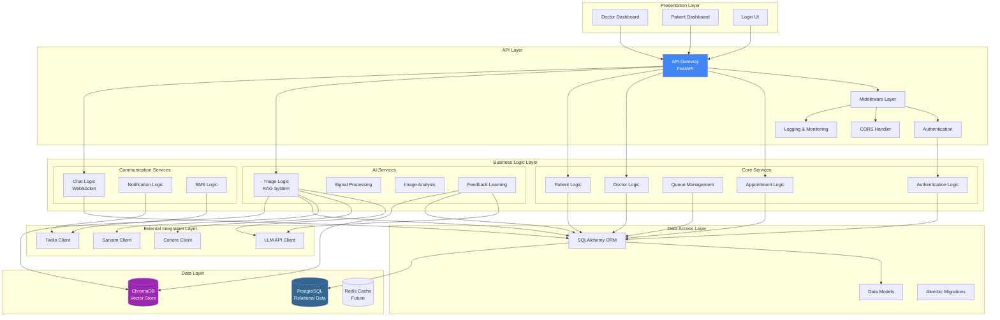

### 3.2 Microservice Internal Structure

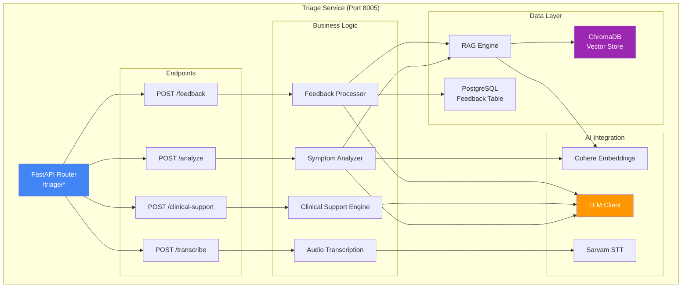

### 3.3 API Request Flow Pattern

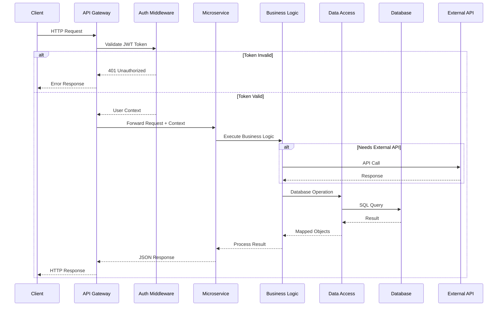

### 3.4 Data Flow Architecture

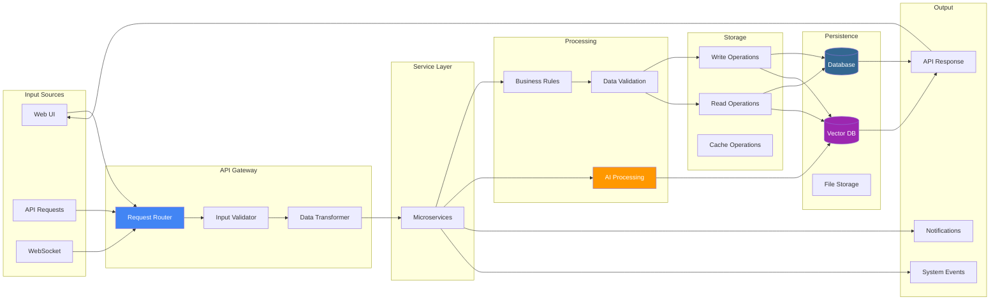

### 3.5 Authentication & Authorization Flow

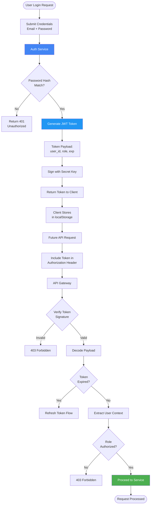

---

## 4. Component Diagram (UML)

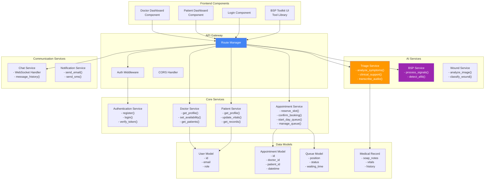

---

## 4. Database Entity Relationship Diagram

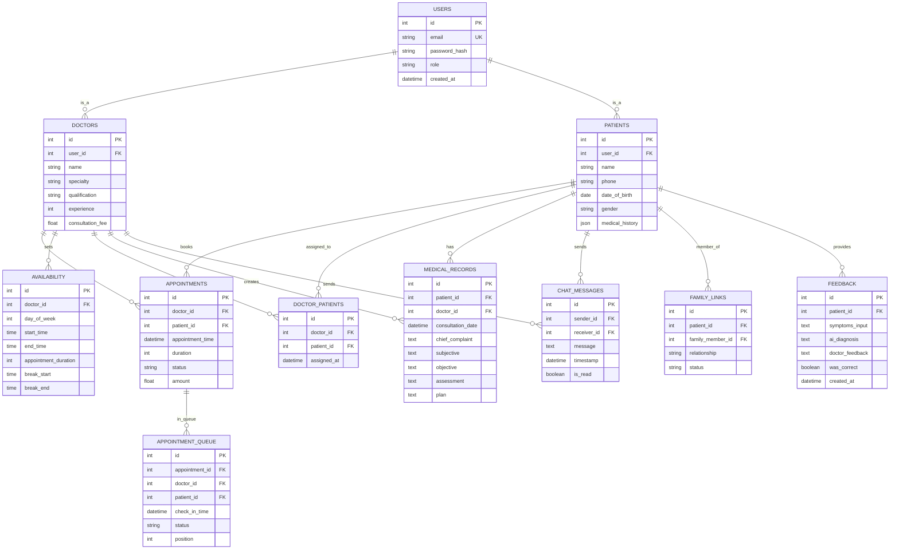

---

## 5. Class Diagram - Core Models

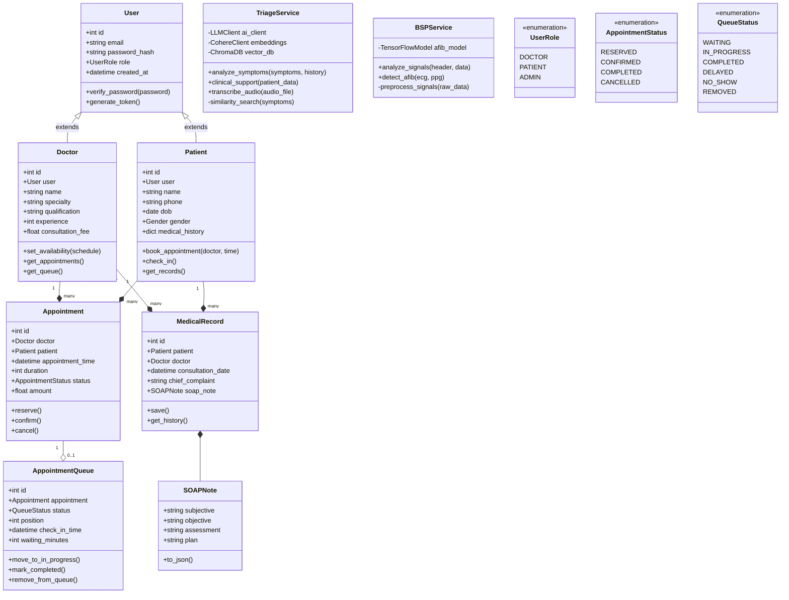

---

## 6. Sequence Diagram - Appointment Booking

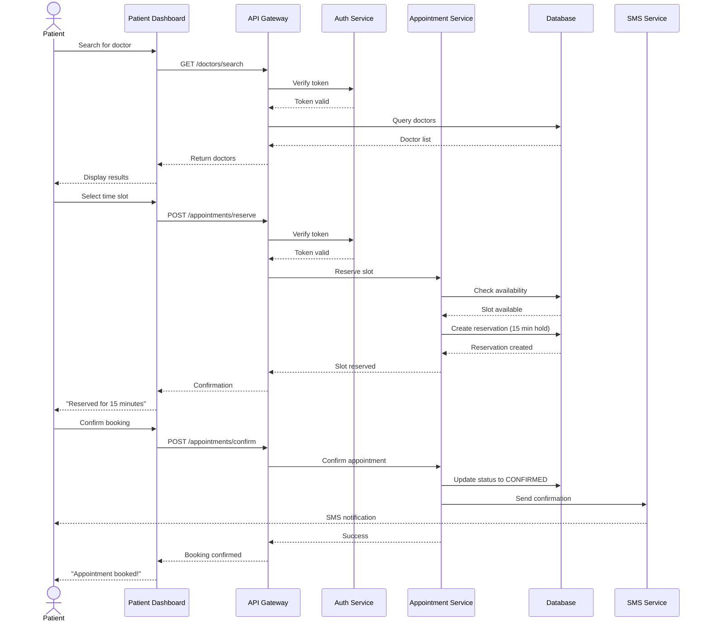

---

## 7. Deployment Architecture

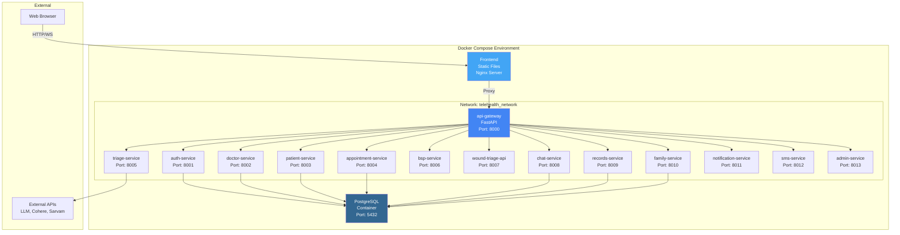

---

## System Metrics

- **Total Microservices**: 13
- **Frontend Pages**: 3 (Doctor Dashboard, Patient Dashboard, Login)
- **Database Tables**: 12+ core entities
- **External Integrations**: 4 (LLM, Cohere, Sarvam, Twilio)
- **Communication Protocols**: REST API, WebSocket
- **Authentication**: JWT-based

## Key Technologies

| Layer | Technologies |
|-------|-------------|
| **Frontend** | HTML5, CSS3, JavaScript (Vanilla) |
| **Backend** | Python 3.11, FastAPI |
| **Database** | PostgreSQL, SQLAlchemy ORM |
| **AI/ML** | LLM, Cohere, TensorFlow |
| **Voice** | Sarvam AI (Hinglish STT) |
| **Messaging** | WebSocket, Twilio SMS |
| **Deployment** | Docker, Docker Compose |
| **Architecture** | Microservices, API Gateway Pattern |
